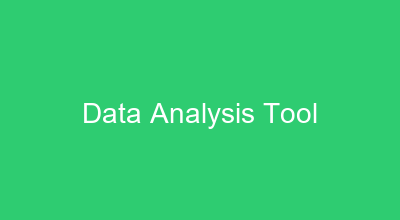

# My Projects
Here are some of the projects I have worked on:
## Project 1: Awesome Web App
- **Description:** A web application that does awesome things.
- **Technologies Used:** React, Node.js, MongoDB
- **GitHub Repository:** [awesome-web-app](http://github.com)
- **Live Demo:** [awesome-web-app-demo](http://example.com)
- **More Info:** To view more details about this project, visit the [project page](projects/awesome-web-app.md).
- **Screenshot:**

  
  
## Project 2: Data Analysis Tool
- **Description:** A tool for analyzing and visualizing data.
- **Technologies Used:** Python, Pandas, Matplotlib
- **GitHub Repository:** [data-analysis-tool](http://github.com)
- **Live Demo:** [data-analysis-tool-demo](http://example.com)
- **More Info:** To view more details about this project, visit the [project page](projects/data-analysis-tool.md).
- **Screenshot:**

  

## More Projects
For a complete list of my projects and repositories, please visit my [GitHub Profile](https://www.github.com/bukhari1986).
